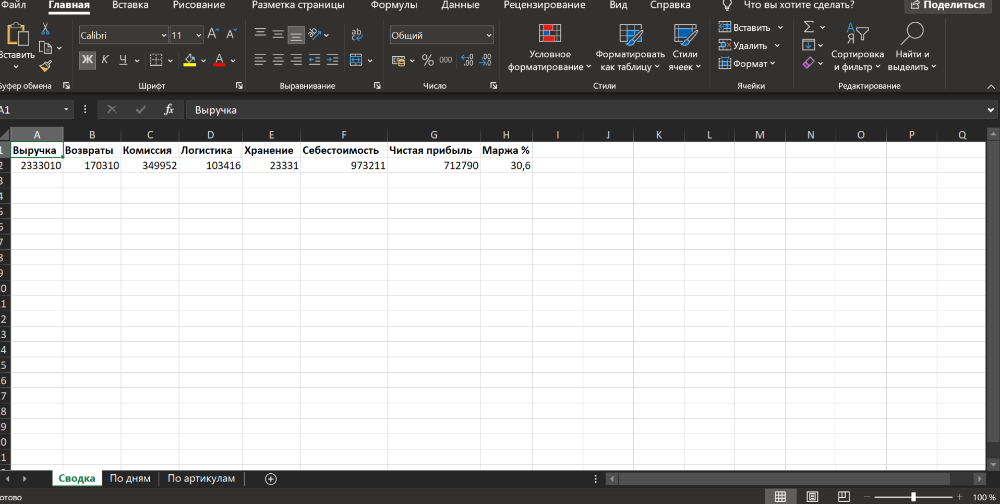
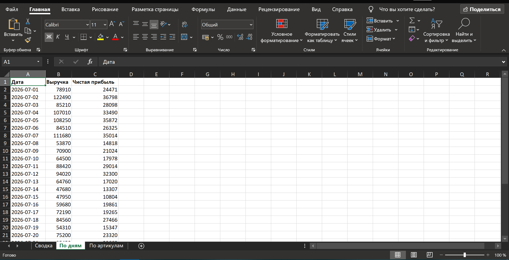

# P&L-отчёт для селлера Wildberries

Автоматический расчёт чистой прибыли селлера маркетплейса.
Python + pandas + openpyxl.

## Проблема (до)

Селлер сводил продажи, комиссии, логистику и хранение вручную:
- 2–3 часа в день уходило на Excel;
- ошибки из-за человеческого фактора;
- непонятна реальная прибыль и маржа по каждому товару.

## Решение (после)

Python-скрипт автоматически:
- загружает данные продаж (демо-данные в формате отчётов WB);
- считает чистую прибыль: выручка − возвраты − комиссия − логистика − хранение − себестоимость;
- формирует Excel-отчёт из трёх листов:
  - **Сводка** — выручка, возвраты, комиссия, логистика, хранение, себестоимость, чистая прибыль, маржа %;
  - **По дням** — динамика выручки и прибыли по дням;
  - **По артикулам** — прибыль и маржа по каждому товару.

## Результат

- время подготовки отчёта: **секунды вместо 2–3 часов**;
- прозрачная маржа по артикулам: 27–33%;
- исключены ошибки ручного сведения.

## Стек

Python 3, pandas, numpy, openpyxl, loguru

## Запуск

pip install -r requirements.txt
python pnl_demo.py

Отчёт сохраняется в data/reports/pnl_demo.xlsx

## Скриншоты отчёта

